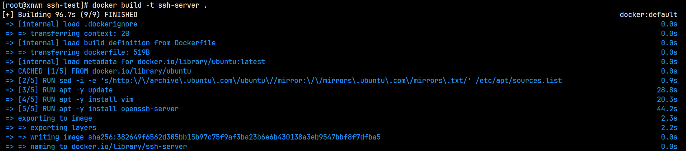
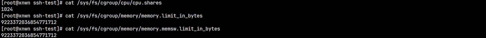
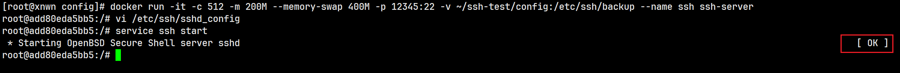
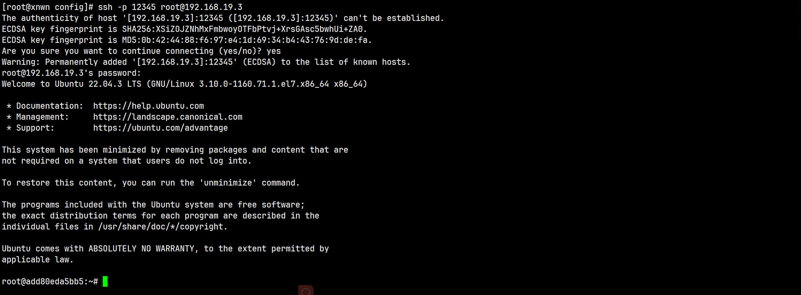
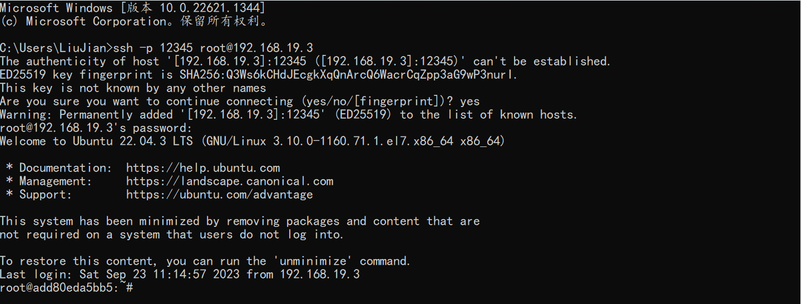

用新版本原因：Dockers发展历史 http://www.doczj.com/doc/181919115.html

#### 安装

**注**: 镜像为CentOS7.9，账户为root。

1. 卸载老版本的Docker。可能提示没有安装过这些package/参数xxx没有匹配，不用管。

```bash
yum remove docker \
           docker-client \
           docker-client-latest \
           docker-common \
           docker-latest \
           docker-latest-logrotate \
           docker-logrotate \
           docker-engine
```

2. 安装yum工具包。https://centos.pkgs.org/7/centos-aarch64/yum-utils-1.1.31-54.el7_8.noarch.rpm.html

```bash
yum -y install yum-utils
```

3. 设置Docker仓库。

```bash
yum-config-manager --add-repo https://download.docker.com/linux/centos/docker-ce.repo (国外官方，不推荐)

yum-config-manager --add-repo https://mirrors.aliyun.com/docker-ce/linux/centos/docker-ce.repo (国内阿里)
```

4. 安装Docker。安装过程选项均选择y。

```
yum install docker-ce
```

5. 启动Docker服务。

```bash
systemctl start docker
```

6. 测试安装是否成功。执行命令会下载一个测试镜像并运行一个容器，输出欢迎内容后就退出。

```bash
docker run hello-world
```

#### 拉取镜像

1. 创建Docker配置文件(默认docker-ce是没有的)

```bash
cd /etc/docker
vi daemon.json
```

2. 添加镜像配置。

```bash
{
	"registry-mirrors": ["https://registry.docker-cn.com"]
}
```

3. 重新启动Docker服务。可以用 `docker info` 命令查看是否更改。

```bash
systemctl restart docker
```

4. 拉取Ubuntu镜像。

```bash
docker pull ubuntu:latest
```

---

#### 搭建SSH服务器

> 实现步骤

1. 创建一个文件夹用于专门保存本次试验的材料，创建Dokcerfile。

```bash
mkdir ssh-test
cd ssh-test
vi Dockerfile
```

2. Dockerfile文件内容如下。

```
# 设置基镜像
FROM ubuntu
# 此处可修改apt源优化下载速度，详情见问题3
# 更新安装源 -y对安装过程的选项均选y
RUN apt  -y update
# 安装vim，纯净Ubuntu镜像初始没有vim
RUN apt -y install vim
# 安装ssh服务器
RUN apt -y install openssh-server
```

3. 执行构建命令。(命令含义: 在当前目录查找Dockerfile构建标签为ssh-server的镜像)

```bash
docker build -t ssh-server .
```



4. 查看宿主机的CPU限制、内存限制和交换空间限制。

```bash
cat /sys/fs/cgroup/cpu/cpu.shares
cat /sys/fs/cgroup/memory/memory.limit_in_bytes
cat /sys/fs/cgroup/memory/memory.memsw.limit_in_
```



5. 根据构建的镜像运行容器，同时根据步骤4进行资源分配，并将ssh服务接口和宿主机对应，最后为持久化配置文件做准备。

```bash
docker run -it -c 512 -m 200M --memory-swap 400M -p 12345:22 -v ~/ssh-test/config:/etc/ssh/backup --name ssh ssh-server 
```

6. 运行 `vi /etc/ssh/sshd_config` 修改ssh配置文件，修改位置如下:

```bash
#PermitRootLogin prohibit-password
PermitRootLogin yes // 新增此行覆盖上行默认配置，配置作用为允许root用户登录ssh服务器
```

7. 运行 `cp ./sshd_config ./backup` 将配置文件复制到backup文件夹中，从而持久化到宿主机。

8. 运行 `service ssh start` 启动ssh服务。



9. 运行 `passwd` 为root账户设置密码。
10. 键盘输入Ctrl+P，Ctrl+Q退出终端，使容器一直保持运行状态。
11. 在虚拟机中运行 `ssh -p 12345 root@192.168.19.3` 测试ssh连接。



12. 在Windows的cmd运行 `ssh -p 12345 root@192.168.19.3` 连接当前ssh服务器。



> 遇到问题

1. 对Dockerfile语法不了解。

**解决**: 通过文档学习。https://docs.docker.com/engine/reference/builder/

2. 执行Docker build命令时出现如下错误。

```bash
ERROR: Cannot connect to the Docker daemon at unix:///var/run/docker.sock. Is the docker daemon running?
```

分析: 通过报错信息得知当前未连接到Docker守护进程，因为此时系统处于刚开机状态，Docker服务未运行。

**解决**: 执行 `systemctl start docker` 开启Docker服务。

3. 执行Docker build命令，安装vim时耗时过长。

分析: 安装时使用的是Ubuntu默认的源，速度较慢。

**解决**: 在Dokcerfile中添加修改apt源命令，让系统自动选择本地最快镜像下载。

```
RUN sed -i -e 's/http:\/\/archive\.ubuntu\.com\/ubuntu\//mirror:\/\/mirrors\.ubuntu\.com\/mirrors\.txt/' /etc/apt/sources.list
```

4. 执行Docker build命令，安装ssh服务器时出现如下错误。

```bash
ERROR: failed to solve: process "/bin/sh -c yum install openssh-server" did not complete successfully: exit code: 127
```

分析: 习惯于CentOS系统，Ubuntu系统安装package时需使用apt命令。

**解决**: 在Dockerfile中将yum命令替换为apt命令。

5. 执行Docker build命令，安装ssh服务器时出现如下错误。

```bash
Package 'openssh-server' has no installation candidate
```

分析: 此时未在Dockerfile中添加更新源命令，而刚安装好的系统里自带的源是旧的，不包括最近收录的程序。

**解决**: 在Dockerfile中，添加更新源命令。

6. 使用 `systemctl start ssh` 启动ssh服务时出现如下错误。

```bash
System has not been booted with systemd as init system (PID 1). Can't operate.
```

分析: 系统通过WSL运行在Windows，只支持sysvinit命令。https://linuxhandbook.com/system-has-not-been-booted-with-systemd/

**解决**: 将启动ssh服务的命令替换为 `service ssh start`。

7. 根据6启动ssh服务时出现如下错误。

```
/etc/ssh/sshd_config: No such file or directory
```

分析: 在run容器时使用-v参数直接将一个空目录与/etc/ssh目录关联，导致后者直接被清空，从而启动服务时找不到配置文件。

**解决**: 将配置文件另外用一个文件夹保存，并且这个文件夹与宿主机文件关联，从而持久化配置文件。

8. 通过Windows的cmd连接ssh服务器时一直验证失败。

分析: 此时并未设置Docker容器中root账户密码，一直都是以虚拟机root账户密码尝试连接。

**解决**: 为Docker容器中root账户设置密码。


#### 测试中(忽略掉)

docker -v xxx:xxx 

桌面版build不能翻墙 只能看运气

https://blog.csdn.net/GoodburghCottage/article/details/131413312  
