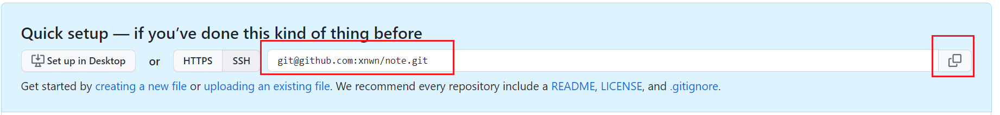

#### 下载

官网下载：https://git-scm.com/downloads (当前2.42.0)

国内下载：https://pc.qq.com/detail/13/detail_22693.html (一直是最新版)

---

#### 安装

> 选择组件

2: 右键菜单添加在当前位置运行Git的两种方式(命令行/图形界面)。

3: 将大型二进制文件如视频/音乐等与代码仓库分离，进行单独管理。

4: 设置默认程序 参考：https://baike.baidu.com/item/%E6%96%87%E4%BB%B6%E5%85%B3%E8%81%94/839454?fr=ge_ala

7: 将Git Bash的配置文件添加在Windows终端中的配置文件中 参考：https://www.cnblogs.com/wswind/p/16337029.html

8: 安装Git附加组件Scalar管理大规模仓库。

> 行尾转换

参考：https://zhuanlan.zhihu.com/p/380574688

CR(Carriage Return): 回车\r。将光标移动到当前行的开头。

LF(Line Feed): 换行\n。将光标下移一行。在Unix/Mac中表示一行文本结束。

Windows-style: 行尾用CRLF表示。

Unix-style: 行尾用LF表示。

as-is: 不作任何变更。

选项1推荐Windows系统的原因：checkout时将文件行尾转为CRLF适应后续Windows编辑，commit时转换为LF简化代码。其他选项类似。

---

#### 上传GitHub

> 前提1: 密钥设置

1. 本地生成SSH密钥保证本地到远端的加密传输。

```bash
ssh-keygen -t rsa -C "1029844720@qq.com" 
```

**注1:** 邮箱自行更改。回车后依次出现 修改存放位置 --> 输入密码(先看注2，输入时不可见) --> 重复密码。可直接全部回车。

**注2**: 个人建议不要设置密码，否则后续进行本地和远端通信时经常要输入密码。(如clone和push时)

2. 根据存放位置找到文件**<u>id_rsa.pub</u>**，将密钥内容复制。
3. 登录Github，依次选择右上角头像 --> Settings --> SSH and GPG keys --> New SSH key。
4. Title任意，密钥内容粘贴到key框中保存。

> 前提2: 设置邮箱和用户名

```bash
git config --global user.email "1029844720@qq.com"
git config --global user.name "xnwn"
```

**注**: 邮箱和名称自行更改。此配置内容位于 **C:\Users\你的用户名\.gitconfig** 文件中，后续可直接在此修改。

> 类型1: 远端到本地(以无远端仓库举例，有远端仓库只需修改第二步)

1. 在Github创建一个repository。
2. 复制仓库地址。若为已有仓库就进入该仓库点击右上角code复制地址。



已有仓库情况如下：


3. 克隆仓库到本地。

```bash
git clone git@github.com:xnwn/note.git
```

4. 在本地仓库新增文件后，通过`cd note`切换到该目录，分别执行以下命令。(后续更新完毕均可使用这三条命令进行推送)

```bash
git add .
git commit -m "new file"
git push 
```

**注**: 作用分别为 添加所有待推送文件 --> 提交到本地仓库(-m后信息推荐输入本次更新内容) --> 推送到远端仓库。

> 类型2: 本地到远端

1. 在Github创建一个repository并复制仓库地址。
2. 在要上传的文件夹中开启一个git终端输入初始化命令对文件夹进行初始化。

```bash
git init
```

3. 将待上传文件添加到本地仓库。

```bash
git add .
git commit -m "first commit"
```

4. 设置远端仓库地址。

```bash
git remote add origin git@github.com:xnwn/note.git
```

5. 推送到远端的master分支。(-u参数只需要此次使用，后续可以不用，分支若后续不指定也可省略，即仅用上节4的三条命令)

```bash
git push -u origin master
```
